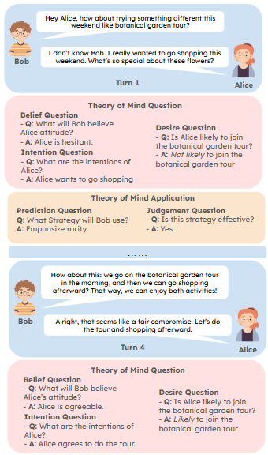

# PersuasiveToM: A Benchmark for Evaluating Machine Theory of Mind in Persuasive Dialogues

We study the theory of mind (ToM) in persuasive dialogues. Specifically, we evaluate ToM reasoning and ToM applications. ToM reasoning evaluates the ability of LLMs for understanding mental states (belief, desire, intention) for both persuaders and perusadees. ToM application evaluates the ability of LLMs for applying the understanding of mental states for persuasion.

More details can be found in our paper:
Fangxu Yu, Lai Jiang, Shenyi Huang, Zhen Wu, Xinyu Dai, "[PersuasiveToM: A Benchmark for Evaluating Machine Theory of Mind in Persuasive Dialogues](https://arxiv.org/abs/2502.21017)" 

## PersuasiveToM



## Code
**1) Download this GitHub**
```
git clone https://github.com/Yu-Fangxu/PersuasiveToM.git
```

**2) Run Command for Evaluation**

```
bash evaluation/run.sh meta-llama/Llama-3.1-8B-Instruct
```

You could change the model path for evaluating different LLMs

<br> **If you find our repository helpful to your research, please consider citing:** <br>
```
@misc{yu2025persuasivetombenchmarkevaluatingmachine,
      title={PersuasiveToM: A Benchmark for Evaluating Machine Theory of Mind in Persuasive Dialogues}, 
      author={Fangxu Yu and Lai Jiang and Shenyi Huang and Zhen Wu and Xinyu Dai},
      year={2025},
      eprint={2502.21017},
      archivePrefix={arXiv},
      primaryClass={cs.CL},
      url={https://arxiv.org/abs/2502.21017}, 
}
```
